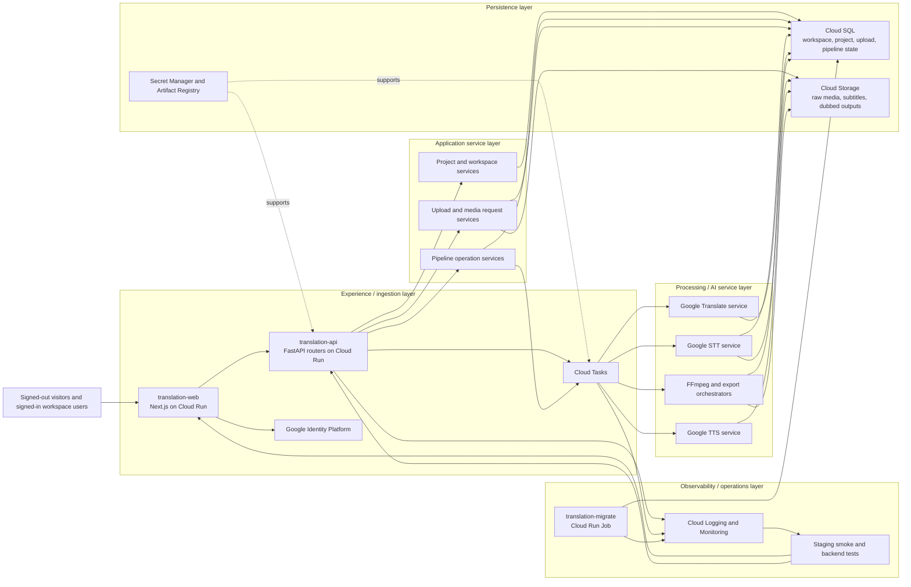

# Enterprise Audio & Video Translation Platform

A production-ready, GCP-first platform for automated video translation, speech-to-text, speaker diarization, context-aware translation with duration matching, speech synthesis, and audio retiming.

---

## Tech Stack


| Layer | Technologies |
| --- | --- |
| **Frontend** | Next.js 16, React 18, TypeScript 5, Tailwind CSS, Zustand, and IndexedDB for local project drafts |
| **Backend / API** | FastAPI, Python 3.10+, Uvicorn, Pydantic v2, async HTTP with HTTPX, and server-sent events for pipeline progress |
| **Database** | PostgreSQL with SQLAlchemy 2 ORM, `asyncpg` for asynchronous application access, `psycopg2` for synchronous workers and migrations, and Alembic |
| **Task orchestration** | Cloud Tasks-backed internal API handlers for production transcription, translation, dubbing, and export execution; local development can still rely on containerized support services where needed |
| **Media and audio processing** | FFmpeg/FFprobe for demuxing, muxing, transcoding, and `atempo` time-stretching; Pydub, Librosa, NumPy, and SciPy for audio analysis and post-processing |
| **Computer vision** | OpenCV headless and Pillow for face detection, frame extraction, and frame metadata |
| **AI services** | Replicate for lip-sync generation, Google Cloud Speech-to-Text for speech-to-text and diarization, Google Cloud Translation Advanced API for translation, and Google Cloud Text-to-Speech for synthesis |
| **Storage** | Google Cloud Storage with resumable multipart uploads, object composition, and V4 signed URLs; MinIO is available as a local Docker service |
| **Authentication and security** | Google Identity Platform/OIDC token verification, workspace-scoped authorization, JWT signing, Google Application Default Credentials, IAM, and Secret Manager |
| **Cloud and deployment** | Docker, Docker Compose, Google Cloud Run, Cloud Run Jobs for Alembic migrations, Cloud SQL for PostgreSQL, Cloud Tasks for optional HTTP task dispatch, and Artifact Registry |
| **Testing** | Pytest with branch coverage, Vitest with V8 coverage, and Playwright critical-path browser tests |
| --- | --- |

---

## GCP Service-Layer Architecture

Following your preferred GCP direction, GlobeSync is organized as layered services instead of a single undifferentiated application tier.

| Layer | GlobeSync responsibility | Primary GCP services | Main code areas |
| --- | --- | --- | --- |
| **Experience / ingestion layer** | Accept signed-in user actions, resumable upload initiation, upload status polling, and internal task entry points | Cloud Run (`translation-api`, `translation-web`), Cloud Tasks, Google Identity Platform, Cloud Load Balancing | `frontend/`, `backend/app/routers/`, `backend/app/services/auth_service.py` |
| **Application service layer** | Enforce workspace boundaries, validate media requests, manage projects, drafts, uploads, and pipeline operations | Cloud Run, Cloud SQL, Secret Manager | `backend/app/services/project_service.py`, `backend/app/services/pipeline_operation_service.py`, `backend/app/services/storage_service.py` |
| **Processing / AI service layer** | Run transcription, translation, subtitle generation, dubbing orchestration, media transforms, and export assembly | Cloud Tasks-triggered internal handlers, Google Speech-to-Text, Google Translate, Google Text-to-Speech, FFmpeg on Cloud Run | `backend/app/services/google_stt_service.py`, `google_translate_service.py`, `google_tts_service.py`, `tts_orchestrator.py`, `video_processor.py`, `video_reconstructor.py`, `export_orchestrator.py` |
| **Persistence layer** | Store relational state, media assets, generated outputs, and deployment/runtime secrets | Cloud SQL for PostgreSQL, Cloud Storage, Secret Manager, Artifact Registry | `backend/app/models/`, `backend/app/core/database.py`, `deploy/` |
| **Observability / operations layer** | Track health, queue execution, deployments, and release validation | Cloud Logging, Cloud Monitoring, Cloud Run Jobs (`translation-migrate`), staging smoke workflows | `backend/app/main.py`, `backend/tests/`, `.github/workflows/`, `deploy/` |

### Mermaid architecture diagram



### Layer interaction flow

* The signed-out marketing site and signed-in workspace UI run through `translation-web` and call the FastAPI surface on `translation-api`.
* Upload and project APIs persist metadata in Cloud SQL while large media payloads stream to Cloud Storage through signed or resumable flows.
* Long-running transcription, translation, dubbing, and export work is dispatched through Cloud Tasks-backed internal handlers rather than being held open in the request path.
* Provider-facing services stay isolated behind the service layer so speech, translation, TTS, and rendering implementations can evolve without changing the API contract.
* Final artifacts, subtitles, and playback assets are written back to Cloud Storage, while job state and audit-friendly entities remain in Cloud SQL.

This layered model maps the codebase onto GlobeSync's target GCP operating shape: presentation at the edge, application services in FastAPI, provider-specific media processing behind orchestrators, and storage split between Cloud SQL and Cloud Storage.

## 📁 Repository Directory Structure

```
audio-video-translation-app/
├── backend/
│   ├── app/
│   │   ├── core/
│   │   │   ├── config.py                 # Pydantic settings, environment configurations, and secrets
│   │   │   ├── database.py               # Async/sync SQLAlchemy PostgreSQL engine & session maker
│   │   │   └── celery_app.py             # Legacy/local queue wiring retained alongside the GCP-first task architecture
│   │   ├── models/
│   │   │   ├── media.py                  # MediaFile, UploadSession, UploadChunk models
│   │   │   ├── transcript.py             # Transcript and TranscriptSegment models
│   │   │   ├── translation.py            # Translation model with duration metrics and iteration history
│   │   │   ├── voice_profile.py          # VoiceProfile model for synthesized speaker voices
│   │   │   └── generated_audio.py        # GeneratedAudio model for retimed TTS audio segments
│   │   ├── schemas/
│   │   │   ├── media_schema.py           # Pydantic v2 schemas for chunked & direct media upload
│   │   │   ├── transcription_schema.py   # Pydantic schemas for STT, diarization & word timestamps
│   │   │   ├── translation_schema.py     # Pydantic schemas for batch translation & duration matching
│   │   │   └── tts_schema.py             # Pydantic schemas for speech synthesis
│   │   ├── services/
│   │   │   ├── storage_service.py        # Cloud Storage upload/download and signed URL service layer
│   │   │   ├── media_service.py          # FFprobe inspection and media metadata extraction
│   │   │   ├── cloud_tasks_service.py    # Cloud Tasks dispatch for internal pipeline execution
│   │   │   ├── project_service.py        # Workspace-scoped project and draft orchestration
│   │   │   ├── pipeline_operation_service.py # Pipeline lifecycle persistence and status coordination
│   │   │   ├── google_stt_service.py     # Google STT transcription provider integration
│   │   │   ├── google_translate_service.py # Google Translation provider integration
│   │   │   ├── google_tts_service.py     # Google TTS synthesis provider integration
│   │   │   ├── tts_orchestrator.py       # Segment synthesis and dubbing orchestration
│   │   │   └── export_orchestrator.py    # Final asset assembly and export coordination
│   │   ├── utils/
│   │   │   ├── error_codes.py            # Standardized ErrorCode enums & custom MediaAppException
│   │   │   ├── file_validators.py        # Magic header inspection, MIME detection, SHA-256 calculators
│   │   │   ├── transcript_parser.py      # Normalizer, word timing aggregator & SRT/VTT/TXT exporters
│   │   │   ├── language_configs.py       # 20+ language specs, speech rates, few-shot examples
│   │   │   ├── speech_rate.py            # Syllabic/character rate calculators & punctuation pause model
│   │   │   ├── prompt_templates.py       # Dubbing system prompts, condensation & expansion prompts
│   │   │   ├── prosody_extractor.py      # F0 pitch contour, RMS energy, warmth & depth analyzer
│   │   │   └── audio_matcher.py          # Speed factor calculator (0.75x - 1.35x) & duration error delta
│   │   ├── tasks/
│   │   │   ├── transcription_tasks.py    # Celery tasks for demuxing, preprocessing & STT
│   │   │   ├── translation_tasks.py      # Celery tasks for batch translation & duration matching
│   │   │   └── tts_tasks.py              # Celery tasks for TTS and master audio mixing
│   │   ├── routers/
│   │   │   ├── upload.py                 # Direct & resumable chunked upload endpoints
│   │   │   ├── transcription.py          # Transcription start, lookup, export & SSE stream
│   │   │   ├── translation.py            # Translation batch, segment edit, export & SSE stream
│   │   │   └── tts.py                    # Voice cloning, batch synthesis, master playback & SSE stream
│   │   └── main.py                       # FastAPI application, global exception handlers, CORS, Request ID
│   ├── tests/
│   │   ├── test_upload_pipeline.py       # Tests for chunked upload, magic bytes, and file validators
│   │   ├── test_transcription_pipeline.py# Tests for STT parser, diarization, and subtitle exports
│   │   ├── test_translation_pipeline.py  # Tests for speech rate, duration matching & translation API
│   │   └── test_tts_pipeline.py          # Tests for speech synthesis and retiming
│   ├── .env.example                      # Environment variables template
│   └── requirements.txt                  # Python dependencies
└── README.md
```

---

## ✅ Prerequisites

Before you begin, ensure you have the following installed on your system:
- **Python** (version 3.10 or newer)
- **Docker Desktop**: Required to run the project's backing services (PostgreSQL, Redis, MinIO). Make sure the Docker daemon is running.
- **FFmpeg**: Required for all media processing tasks. Ensure the `ffmpeg` and `ffprobe` commands are available in your system's PATH.

## 🚀 Getting Started

### 1. Environment Setup
```bash
# Navigate to the backend directory
cd backend

# (Recommended) Create and activate a Python virtual environment
# python -m venv venv
# source venv/bin/activate  (or .\venv\Scripts\activate on Windows)

# Install Python dependencies
pip install -r requirements.txt

# Copy the example environment file. The default values are configured
# to work with the docker-compose setup.
cp .env.example .env
```

### Google Cloud Translation

To use Google Cloud Translation Advanced, download a JSON key for the service
account that has the **Cloud Translation API User** role. Save it outside the
repository (or in `backend/`, which is ignored), then add these values to
`backend/.env`:

```env
TRANSLATION_PROVIDER="google"
GOOGLE_CLOUD_PROJECT="your-google-cloud-project-id"
GOOGLE_APPLICATION_CREDENTIALS="C:/absolute/path/to/service-account.json"
```

Install dependencies again after this change: `pip install -r requirements.txt`.
The Google account email is not used by the application; the project ID and
service-account credentials determine access. Google Cloud translations are measured for duration and then retimed in the
media pipeline.

### 2. Start Services
```bash
# Start FastAPI Web Server
# In a separate terminal, start the backing services (PostgreSQL, Redis, MinIO).
# Note: Use 'docker compose' (with a space) for modern Docker versions.
# If you have an older version, you might need 'docker-compose' (with a hyphen).
docker compose up -d

# Start the FastAPI Web Server in your main terminal
uvicorn app.main:app --host 0.0.0.0 --port 8000 --reload

# Start the Next.js Frontend in new terminal
cd D:\audio-video-translation-app\frontend
npm install
npm run dev

# Start Celery Worker Pools
celery -A app.core.celery_app worker -Q audio_extract,stt_diarize,translation,tts_clone,audio_retiming -c 4 --loglevel=info
```

### 3. Run Test Suite
```bash
cd backend
pip install -r requirements-dev.txt
python -m pytest --cov=app --cov-branch --cov-report=term-missing --cov-report=xml --cov-report=json

cd ../frontend
npm ci
npm run test:coverage
npm run build
npx playwright install chromium
npm run test:e2e
```