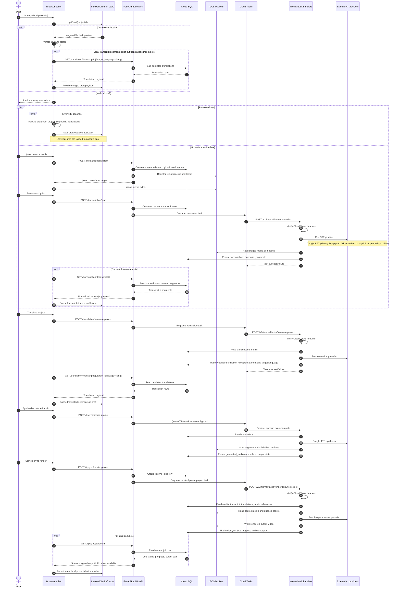

# GlobeSync Phase 0 Runtime Sequence Diagram

This document captures the current runtime sequence for the GlobeSync editor and media-processing pipeline before backend-owned `projects` and `project_drafts` APIs are introduced.

## Purpose

* Show the current control flow across browser, API, Cloud Tasks, Cloud SQL, and GCS
* Make the IndexedDB-first editor dependency explicit
* Highlight where the backend already owns pipeline execution versus where the browser still owns session state
* Identify sequence gaps that Phase 2 should change during `/projects` cutover

## Scope

This diagram reflects the current reviewed behavior across:

* [page.tsx](#file-3239543912549008)
* [useProject.ts](#file-/Users/roboplaylab@gmail.com/globesync/frontend/hooks/useProject.ts)
* [projectService.ts](#file-/Users/roboplaylab@gmail.com/globesync/frontend/services/projectService.ts)
* [apiClient.ts](#file-/Users/roboplaylab@gmail.com/globesync/frontend/services/apiClient.ts)
* [main.py](#file-3239543912548896)
* [transcription.py](#file-3239543912548912)
* [translation.py](#file-3239543912548913)
* [tts.py](#file-3239543912548914)
* [lipsync.py](#file-3239543912548911)
* [internal_tasks.py](#file-3239543912548910)
* [cloud_tasks_service.py](#file-/Users/roboplaylab@gmail.com/globesync/backend/app/services/cloud_tasks_service.py)
* [current-state-inventory.md](#file-2060193141886680)

## Actors

* Browser editor
* Browser IndexedDB (`project_drafts` object store)
* FastAPI public API (`translation-api`)
* Cloud Tasks
* FastAPI internal task handlers (`/v1/internal/tasks/*`)
* Cloud SQL
* GCS
* External AI providers (Google STT, Deepgram fallback, translation provider, Google TTS, lip-sync provider)

## Current end-to-end sequence

## Sequence notes by stage

### 1. Editor hydration

* The editor is blocked on local IndexedDB presence rather than backend project existence.
* No reviewed backend `/projects` read occurs during initial page load.
* Device portability is therefore limited to whichever browser has the draft payload.

### 2. Draft persistence

* Draft persistence is full-document rewrite behavior, not patch-based updates.
* `projectMetadata.updatedAt` is updated locally before each save.
* Draft save failures do not currently surface in the user interface.

### 3. Media and transcription

* Backend processing is already async and GCP-native through Cloud Tasks.
* Transcript rows and segment rows are persisted in Cloud SQL and are better positioned than browser state to be canonical.
* The editor still duplicates transcript-derived state back into IndexedDB after retrieval.

### 4. Translation

* Batch translation writes normalized rows to Cloud SQL.
* The editor then rehydrates its own cached translation array from backend results.
* Current batch translation behavior replaces existing rows for the same segment and target language.

### 5. TTS and lip-sync

* Following your GCP-first preference, runtime TTS/STT now centers on Google-managed speech services where possible.
* TTS output and rendered video artifacts land in GCS, while job/output metadata lands in Cloud SQL.
* Lip-sync completion in the editor still depends on polling `GET /lipsync/job/{jobId}` rather than an event-driven project-state channel.

## Current ownership split revealed by the sequence

| Concern | Current authority | Evidence in sequence |
| --- | --- | --- |
| Project/session existence | Browser IndexedDB | Editor load starts with `getDraft(projectId)` and redirects if absent |
| Project metadata | Browser draft mirror | No reviewed `/projects` API on initial load |
| Media binaries | GCS | Upload target and artifact storage are object-backed |
| Pipeline execution | Backend + Cloud Tasks | Async internal task handlers drive processing |
| Transcript segments | Cloud SQL, then cached locally | Persisted in backend, copied back into draft |
| Translation segments | Cloud SQL, then cached locally | Persisted in backend, copied back into draft |
| Lip-sync progress UX | API polling | Repeated `GET /lipsync/job/{jobId}` loop |

## Sequence gaps this artifact makes explicit

* The browser, not Cloud SQL, is still the entrypoint for project existence.
* Canonical project metadata does not yet have a reviewed backend read/write path.
* Transcript and translation state are stored twice: normalized in Cloud SQL and cached inline in drafts.
* Progress delivery is mixed between available SSE endpoints and polling-driven UI behavior.
* There is still no workspace-scoped project container coordinating auth, ownership, draft versioning, and processing pointers.

## What Phase 2 should change

When `/projects` and `/projects/{project_id}/draft` are introduced, the intended sequence shift is:

* page load starts with backend project lookup, not local draft lookup
* server draft payload becomes the primary hydration source
* IndexedDB becomes a cache/fallback layer rather than the system of record
* project metadata stops being browser-authored state
* concurrency moves from silent overwrite to server-enforced draft version checks

## Recommended follow-on artifact

The next useful document after this one is the deployment and rollback checklist, because the runtime sequence now makes it clearer which deploy ordering dependencies matter most:

* `translation-migrate` before schema-dependent API deploys
* `translation-api` before `translation-web` when route contracts change
* frontend cache and local-draft compatibility considerations during cutover
