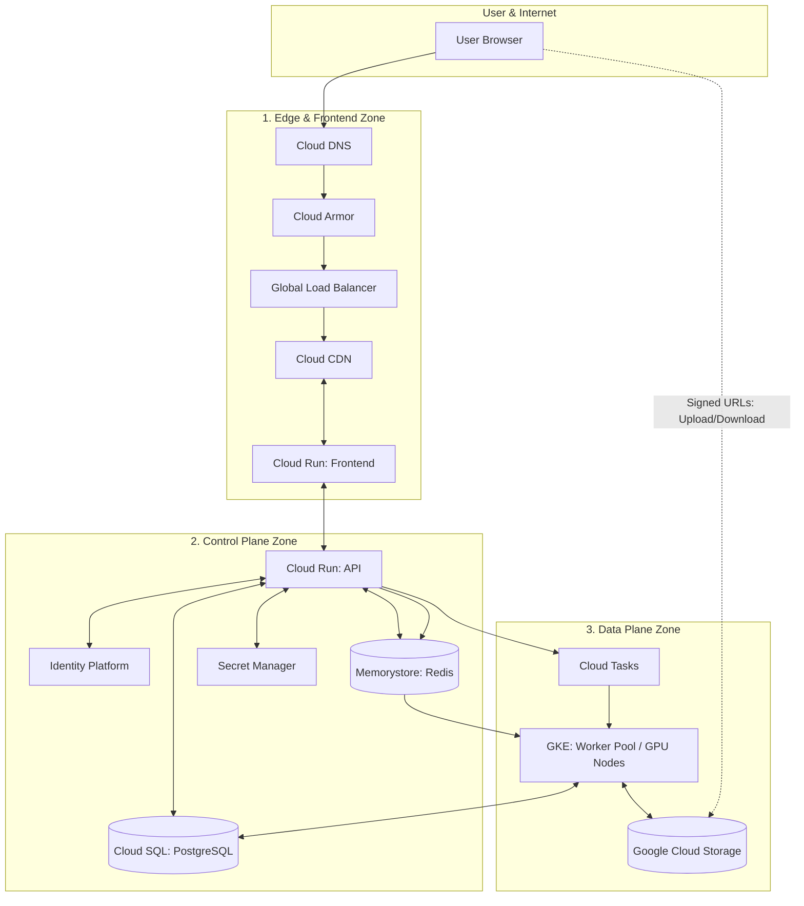

# 🌐 Globesync: Global Scale GCP Architecture

This document provides a visual representation of the production-ready, three-zone architecture designed for the **globesync** platform.

---

## 📊 Architecture Diagram (Mermaid)

---

## 🗺️ Architectural Breakdown

### **1. Edge & Frontend Zone**
*   **Purpose:** Handles user entry, security filtering, and static content delivery.
*   **Key Components:** 
    *   `Cloud DNS`: Global name resolution.
    *   `Cloud Armor`: WAF for DDoS and web-attack protection.
    *   `Global Load Balancer`: Single entry point for all global traffic.
    *   `Cloud CDN`: Low-latency content delivery.
    *   `Cloud Run (Frontend)`: Scalable, containerized hosting for the Next.js UI.

### **2. Control Plane Zone (The Brains)**
*   **Purpose:** Manls identity, application logic, metadata, and task orchestration.
*   **Key Components:** 
    *   `Cloud Run (API)`: The stateless, highly-scalable FastAPI application.
    *   `Identity Platform`: Managed OIDC/JWT identity and user management.
    *   `Cloud SQL (PostgreSQL)`: The primary source of truth for all application metadata.
    *   `Memorystore (Redis)`: High-speed task brokering and real-time state management.
    *   `Secret Manager`: Secure storage for all sensitive credentials and API keys.

### **3. Data Plane Zone (The Muscles)**
*   **Purpose:** Performs the heavy-duty, compute-intensive media processing.
*   **Key Components:** 
    *   `GKE (Worker Pool)`: Scalable, specialized GPU-enabled nodes that process the heavy AI/Video tasks.
    *   `GCS (Storage)`: The high-durability data lake for all raw and processed media assets.
    *   `Cloud Tasks`: Provides reliable, asynchronous task dispatching for specific automation workflows.

---

## 🚀 Key Design Principles

### **A. The "Control vs. Data" Split**
The architecture is split to ensure that the **Control Plane** (API) remains lightning-fast and lightweight, while the heavy lifting is offloaded to the **Data Plane** (GKE/GPU). This prevents a single large video upload or complex AI task from impacting the responsiveness of the entire application.

### **B. The "Direct-to-Cloud" Data Path**
To achieve global scale, the user's browser communicates directly with **GCS via Signed URLs**. This bypasss the API servers entirely for large data transfers, drastically reducing bandwidth costs and preventing the "bottlenecking" of your web servers.

### **C. Distributed Reliability**
By using managed services like `Cloud SQL`, `Memorystore`, and `Identity Platform`, the system inherits Google's global reliability, allowing you to focus on your core product rather than managing infrastructure.
