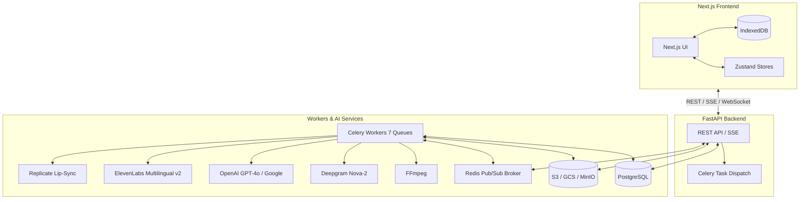

# GlobeSync High-Level Architecture

GlobeSync is an enterprise-grade, cloud-agnostic platform that takes any audio or video file and produces a fully dubbed, lip-synced translation in a target language. It automates the entire pipeline from raw media to a finished translated MP4.

## System Architecture Overview

## The 8-Stage Pipeline

| # | Stage | Description | Key Technologies |
|---|-------|-------------|------------------|
| **1** | **Upload** | User creates a project in the UI and uploads a video. Validation is performed before storing the file in object storage. | Next.js, FastAPI, S3/GCS/MinIO |
| **2** | **Audio Extraction** | FFmpeg demuxes the file to a 16 kHz mono WAV, applies noise reduction and −20 LUFS loudness normalization, then chunks it. | Celery (`audio_extract`), FFmpeg |
| **3** | **STT + Diarization** | Transcribes each chunk with speaker labels and word-level timestamps. Segments are merged and saved to DB. | Celery (`stt_diarize`), Deepgram |
| **4** | **Translation** | Translates all segments in parallel batches. Segments are iteratively rewritten until they fit within ±10% of original duration. | Celery (`translation`), GPT-4o / Google Cloud |
| **5** | **Voice Cloning & TTS** | Harvests 30–90s of audio per speaker to clone voices, then synthesizes every translated segment. | Celery (`tts_clone`), ElevenLabs |
| **6** | **Audio Retiming** | Time-stretches each synthesized clip (0.75×–1.35×) to land within ±100 ms of its original timestamp. | Celery (`audio_retiming`), FFmpeg atempo |
| **7** | **Neural Lip-Sync** | Renders facial animation per segment (falling back to audio mux if no face is detected). | Celery (`lipsync_render`), Replicate |
| **8** | **Export** | Clips are stitched into a final H.264 MP4 with the master dub and subtitles burned in or soft-attached. | Celery (`mux_export`), FFmpeg |

## Key Design Decisions

> [!TIP]
> **Duration-Matching Feedback Loop**
> Every translated segment is iteratively rewritten until its estimated spoken duration fits within ±10 % of the original to prevent audio from running over its video window.

> [!NOTE]
> **Per-Speaker Voice Cloning**
> Harvests clean speech per speaker from the original video to create a voice profile. All TTS segments for that speaker are synthesized with their cloned voice.

> [!IMPORTANT]
> **Graceful Lip-Sync Fallback**
> If no face is detected in a segment, the pipeline skips neural rendering and muxes the dubbed audio directly, ensuring no blocking on segments without lip-sync benefits.
